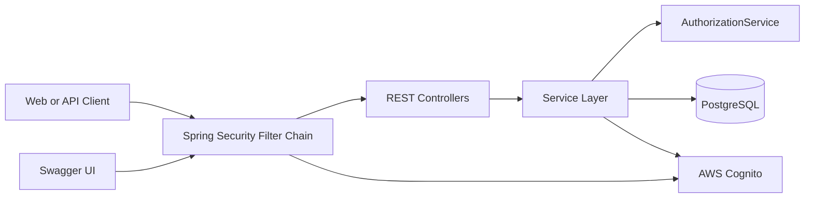
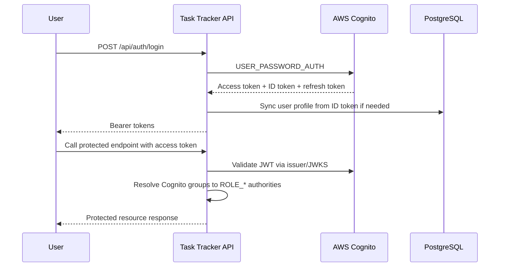
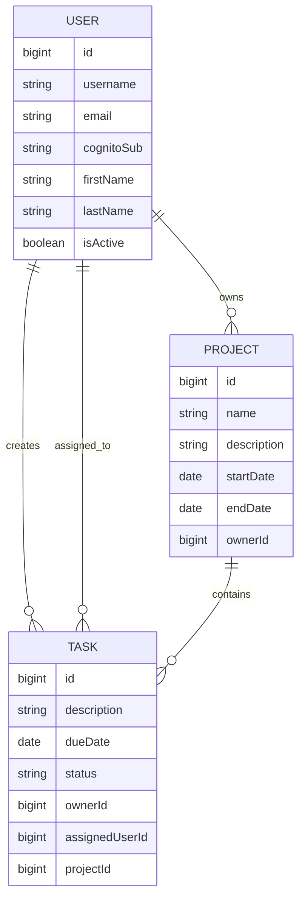

# Task Tracker Backend

Spring Boot backend for the Task Tracker system. It exposes REST APIs for authentication, users, projects, and tasks, uses PostgreSQL for application data, and relies on AWS Cognito for authentication and role-based access control.

## Overview

- Base URL: `http://localhost:8080/api`
- Swagger UI: `http://localhost:8080/api/swagger-ui.html`
- OpenAPI JSON: `http://localhost:8080/api/v3/api-docs`
- Health check: `GET /api/auth/health`
- Packaging: `war`

## Core Capabilities

- Cognito-backed sign-up, login, token refresh, email confirmation, and password reset
- JWT-secured APIs through Spring Security OAuth2 Resource Server
- Project lifecycle management with owner-aware authorization
- Task lifecycle management, assignment, and status tracking
- User profile storage in PostgreSQL with Cognito identity synchronization
- Swagger/OpenAPI documentation for interactive API exploration

## Architecture



### Authentication Flow



### Domain Model



## Technology Stack

- Java 17
- Spring Boot 3.5.10
- Spring Web
- Spring Data JPA
- Spring Security
- OAuth2 Resource Server with JWT
- PostgreSQL
- AWS SDK v2 for Cognito and STS
- springdoc OpenAPI / Swagger UI
- Maven
- Lombok

## Security Model

Authentication is handled by AWS Cognito. API authorization is enforced with JWT claims, where Cognito groups are converted into Spring Security authorities using the `ROLE_` prefix.

Supported roles:

- `ADMIN`: full access across users, projects, and tasks
- `TASK_CREATOR`: can create projects and tasks; can update or delete owned resources; can assign tasks
- `READ_ONLY`: can view protected resources and can update status only for tasks assigned to them

Notes:

- Passwords are not stored in the local database.
- New registrations are added to the `READ_ONLY` group by default.
- User profile records are synced into PostgreSQL after registration or login.

## Functional Layout

### Controllers

- `AuthController`: Cognito auth, confirmation, token refresh, role assignment, password reset
- `ProjectController`: CRUD and ownership-based project queries
- `TaskController`: CRUD, task assignment, task status updates, personal task views
- `UserController`: user profile CRUD and current-user lookups

### Services

- `CognitoAuthService`: wraps Cognito user and token operations
- `AuthorizationService`: centralizes ownership and role checks
- `ProjectService`: project business logic and DTO mapping
- `TaskService`: task business logic, assignment, and status rules
- `UserService`: user profile persistence and Cognito sync support

## API Summary

All endpoints below are relative to `/api`.

### Authentication

| Method | Endpoint | Purpose | Auth |
| --- | --- | --- | --- |
| `POST` | `/auth/register` | Register a user in Cognito | Public |
| `POST` | `/auth/confirm` | Confirm sign-up with verification code | Public |
| `POST` | `/auth/login` | Authenticate and receive tokens | Public |
| `POST` | `/auth/refresh` | Refresh access token | Public |
| `POST` | `/auth/forgot-password` | Start reset-password flow | Public |
| `POST` | `/auth/confirm-forgot-password` | Complete reset-password flow | Public |
| `POST` | `/auth/assign-role` | Replace a user's Cognito role/group | `ADMIN` |
| `POST` | `/auth/remove-role` | Remove a Cognito role/group from a user | `ADMIN` |
| `GET` | `/auth/health` | Service health endpoint | Public |

### Projects

| Method | Endpoint | Purpose | Auth |
| --- | --- | --- | --- |
| `POST` | `/projects` | Create a project | `ADMIN`, `TASK_CREATOR` |
| `GET` | `/projects` | List all projects | Authenticated |
| `GET` | `/projects/{id}` | Get project by ID | Authenticated |
| `GET` | `/projects/owner/{username}` | Get projects for a specific owner | Authenticated |
| `GET` | `/projects/my-projects` | Get projects owned by current user | Authenticated |
| `PUT` | `/projects/{id}` | Update a project | `ADMIN` or project owner |
| `DELETE` | `/projects/{id}` | Delete a project | `ADMIN` or project owner |

### Tasks

| Method | Endpoint | Purpose | Auth |
| --- | --- | --- | --- |
| `POST` | `/tasks` | Create a task | `ADMIN`, `TASK_CREATOR` |
| `GET` | `/tasks` | List all tasks | Authenticated |
| `GET` | `/tasks/{id}` | Get task by ID | Authenticated |
| `GET` | `/tasks/project/{projectId}` | Get tasks in a project | Authenticated |
| `GET` | `/tasks/assigned/{username}` | Get tasks assigned to a user | Authenticated |
| `GET` | `/tasks/my-tasks` | Get tasks assigned to current user | Authenticated |
| `GET` | `/tasks/status/{status}` | Filter tasks by status | Authenticated |
| `PUT` | `/tasks/{id}` | Update task details | `ADMIN` or allowed owner/assignee flow |
| `PATCH` | `/tasks/{taskId}/assign/{username}` | Assign task to a user | `ADMIN`, `TASK_CREATOR` |
| `PATCH` | `/tasks/{taskId}/status/{status}` | Update task status | Role and ownership aware |
| `DELETE` | `/tasks/{id}` | Delete a task | `ADMIN` or task owner |

### Users

| Method | Endpoint | Purpose | Auth |
| --- | --- | --- | --- |
| `POST` | `/users` | Create a user profile record | `ADMIN` |
| `GET` | `/users` | List all users | Authenticated |
| `GET` | `/users/me` | Get current user profile | Authenticated |
| `GET` | `/users/{id}` | Get user by ID | Authenticated |
| `GET` | `/users/username/{username}` | Get user by username | Authenticated |
| `PUT` | `/users/{id}` | Update a user profile | `ADMIN` or self-service path |
| `DELETE` | `/users/{id}` | Delete a user from DB and Cognito | `ADMIN` |

## DTOs and Main Entities

### `ProjectDTO`

- `id`
- `name`
- `description`
- `startDate`
- `endDate`
- `ownerId`
- `ownerUsername`

### `TaskDTO`

- `id`
- `description`
- `dueDate`
- `status`
- `ownerId`
- `ownerUsername`
- `assignedUserId`
- `assignedUsername`
- `projectId`
- `projectName`

### `UserDTO`

- `id`
- `username`
- `email`
- `cognitoSub`
- `firstName`
- `lastName`
- `isActive`
- `roles`

### Task Status Values

- `NEW`
- `IN_PROGRESS`
- `BLOCKED`
- `COMPLETED`
- `NOT_STARTED`

## Local Setup

### Prerequisites

- JDK 17+
- Maven 3.9+
- PostgreSQL 12+
- AWS account with Cognito User Pool configured

### 1. Create the database

```sql
CREATE DATABASE tasktracker;
```

### 2. Configure runtime properties

The application currently reads Spring and AWS settings from `src/main/resources/application.properties`. For local or deployed environments, prefer overriding these values through environment variables or external configuration instead of committing secrets.

Common overrides:

```powershell
$env:SPRING_DATASOURCE_URL="jdbc:postgresql://localhost:5432/tasktracker"
$env:SPRING_DATASOURCE_USERNAME="postgres"
$env:SPRING_DATASOURCE_PASSWORD="change-me"
$env:SPRING_SECURITY_OAUTH2_RESOURCESERVER_JWT_ISSUER_URI="https://cognito-idp.<region>.amazonaws.com/<user-pool-id>"
$env:AWS_COGNITO_REGION="<region>"
$env:AWS_COGNITO_USERPOOLID="<user-pool-id>"
$env:AWS_COGNITO_CLIENTID="<app-client-id>"
$env:AWS_COGNITO_CLIENTSECRET="<app-client-secret>"
$env:AWS_ACCESSKEYID="<aws-access-key>"
$env:AWS_SECRETKEY="<aws-secret-key>"
```

### 3. Build and run

```bash
mvn clean install
mvn spring-boot:run
```

The API will start at `http://localhost:8080/api`.

## Example Requests

### Register

```http
POST /api/auth/register
Content-Type: application/json

{
  "username": "john.doe",
  "password": "P@ssw0rd123",
  "email": "john.doe@example.com"
}
```

### Login

```http
POST /api/auth/login
Content-Type: application/json

{
  "username": "john.doe",
  "password": "P@ssw0rd123"
}
```

### Create project

```http
POST /api/projects
Authorization: Bearer <access-token>
Content-Type: application/json

{
  "name": "Task Tracker Revamp",
  "description": "Backend and UI improvements",
  "startDate": "2026-04-01",
  "endDate": "2026-06-30"
}
```

### Create task

```http
POST /api/tasks
Authorization: Bearer <access-token>
Content-Type: application/json

{
  "description": "Document backend API",
  "dueDate": "2026-04-20",
  "status": "NEW",
  "projectId": 1
}
```

## Project Structure

```text
tasktrackerapp/
|-- src/
|   |-- main/
|   |   |-- java/com/task/tracker/tasktrackerapp/
|   |   |   |-- config/
|   |   |   |-- controller/
|   |   |   |-- dto/
|   |   |   |-- entity/
|   |   |   |-- enums/
|   |   |   |-- exception/
|   |   |   |-- repository/
|   |   |   |-- service/
|   |   |   |-- Utility/
|   |   |   |-- ServletInitializer.java
|   |   |   `-- TasktrackerappApplication.java
|   |   `-- resources/
|   |       `-- application.properties
|   `-- test/
|-- Dockerfile
|-- pom.xml
|-- QUICK_START.md
`-- README.md
```

## Deployment Notes

- The project is packaged as a WAR and can run on embedded Tomcat or an external servlet container.
- Current configuration targets PostgreSQL and AWS Cognito, so deployed environments should externalize all secrets and environment-specific URLs.
- CORS is enabled for localhost, LAN testing, a CloudFront frontend, and Cloudflare tunnel domains.

